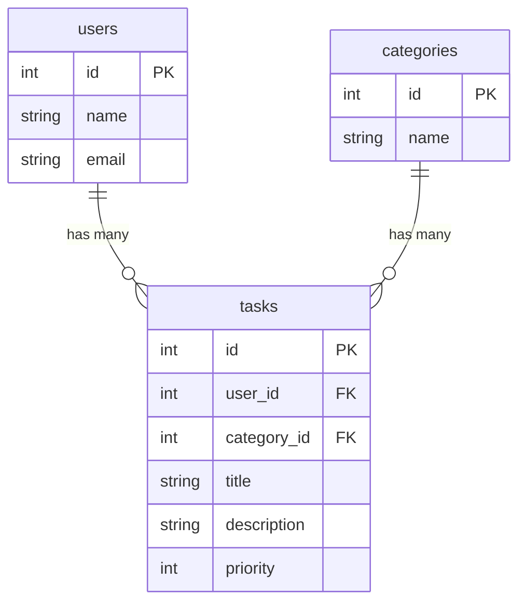

# COACHTECH タスク管理アプリ

やるべきタスクを管理し、進捗を把握できる

## 作成者

溝口　竣介

## 使用技術

- PHP 8.x
- Laravel 12.x
- MySQL 8.x
- Docker / Laravel Sail
- PHPUnit 11.x
- Git / GitHub

## ER図



## 開発環境URL

http://localhost

## 動作環境

本アプリケーションは**Docker（Laravel Sail）**を利用して動作します。

## 環境構築手順

1. **リポジトリをクローン**

    ```bash
    git clone https://github.com/shunsukem1993-a11y/task-manager-2.git
    ```

2. **.envファイルの準備**
    
    .env.exampleをコピーして.envファイルを作成します。
    ```bash
    cp .env.example .env
    ```

3. **Composer依存パッケージのインストール**

    Composerで依存パッケージをインストールします。
    ```bash
    composer install
    ```

4. **Laravel Sailの起動**

    Dockerコンテナを起動します。
    ```bash
    ./vendor/bin/sail up -d
    ```

5. **アプリケーションキーの生成**

    Laravelのアプリケーションキーを生成します。
    ```bash
    ./vendor/bin/sail artisan key:generate
    ```

6. **データベースのマイグレーションと初期データ投入**

    テーブルを作成し、必要に応じてシーダーを実行します。
    ```bash
    ./vendor/bin/sail artisan migrate --seed
    ```
    ※シーダーを使用していない場合は、以下を実行してください。
    ```bash
    ./vendor/bin/sail artisan migrate
    ```

7. **フロントエンドのビルド**

    Node.jsの依存パッケージをインストールし、開発用ビルドを実行します。
    ```bash
    npm install
    npm run dev
    ```

8. **アプリケーションへのアクセス**

    ブラウザで以下のURLにアクセスします。
    ```bash
    http://localhost
    ```

## テスト実行

PHPUnitによるテストを実行する場合は、以下のコマンドを実行してください。
```bash
./vendor/bin/sail test
```
特定のテストファイルのみを実行する場合は、以下のように指定できます。

- CategoryControllerTestを実行
```bash
./vendor/bin/sail test tests/Feature/CategoryControllerTest.php
```

- TaskControllerTestを実行
```bash
./vendor/bin/sail test tests/Feature/TaskControllerTest.php
```

- AuthenticationTestを実行
```bash
./vendor/bin/sail test tests/Feature/AuthenticationTest.php
```

- RegistrationTestを実行
```bash
./vendor/bin/sail test tests/Feature/RegistrationTest.php
```

- UnauthenticatedRedirectTestを実行
```bash
./vendor/bin/sail test tests/Feature/UnauthenticatedRedirectTest.php
```

- ApiTaskTestを実行
```bash
./vendor/bin/sail test tests/Feature/ApiTaskTest.php
 ```

## 機能一覧

- ユーザー登録機能
- ログイン・ログアウト機能
- タスク一覧表示機能
- タスク詳細表示機能
- タスク作成機能
- タスク編集機能
- タスク削除機能
- カテゴリー一覧表示機能
- カテゴリー詳細表示機能
- カテゴリー作成機能
- カテゴリー編集機能
- カテゴリー削除機能
- タスクへのカテゴリー設定機能
- タスク優先度設定機能
- バリデーション機能
- 認証機能
- 認可機能（Policy）
- REST API
- PHPUnitによるテスト

## APIエンドポイント一覧

本アプリケーションで提供している主なREST APIの一覧です。

タスクAPI

| HTTPメソッド | URI | 概要 |
|--------------|-----|------|
| GET | /api/tasks | タスク一覧を取得 |
| GET | /api/tasks/{id} | タスク詳細を取得 |
